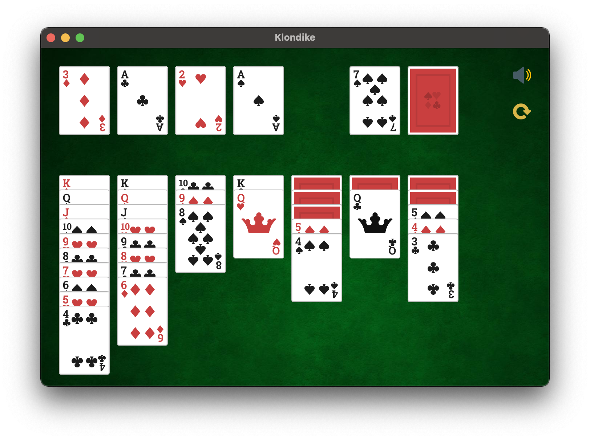

# Klondike
A Klondike game written in C++


# Prerequirement

To build the game, you will need to install the `SFML` library:  
https://www.sfml-dev.org/download/sfml/2.5.1/

You will also need `cmake` with a version upper or equal to `3.17`
```sh
pip install cmake
```

# Build

After cloning the repository enter the following commands to build the game :
```
cmake . -B build
cmake --build build
```

# Usage
```
./Klondike
```
