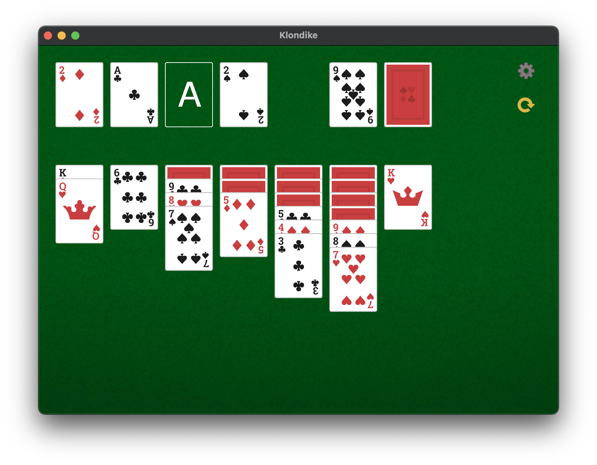

# Klondike
A Solitaire game written in C++



# Installation
You will need the SFML library :
```sh
# on Ubuntu

sudo apt-get install libsfml-dev

# on Mac OS

brew install sfml
```
After cloning the repository enter the following command :
```
make
```

# Usage
```sh
./Klondike
```